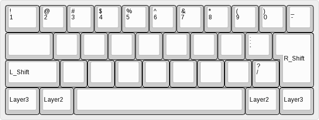

# ZMK firmware for Tightwriter

## [Tightwriter](https://github.com/takashicompany/tightwriter)

---

## additional parts for wireless connection

|Part name|Amount|Link|
|----|----|----|
|nice!nano compatible board|1|[aliexpress (SuperMini NRF52840)](https://ja.aliexpress.com/item/1005006035267231.html?spm=a2g0o.order_list.order_list_main.5.75ce585aIIqGNS&gatewayAdapt=glo2jpn)|
|Li-Po battery (301230)|1|[aliexpress](https://ja.aliexpress.com/item/1005005348368664.html?spm=a2g0o.order_list.order_list_main.10.75ce585aIIqGNS&gatewayAdapt=glo2jpn)|

---
## keymap

### Base (Layer 0)

### Layer 1

### Layer 2

### Layer 3

### Combo (Layer 0)

### Hold (Layer 0)

### Layer BT

- keymap inspired by [40% Keyboards Wiki](https://40s.wiki/how)
- keymap image by [keyboard-layout-editor.com](http://www.keyboard-layout-editor.com/)
